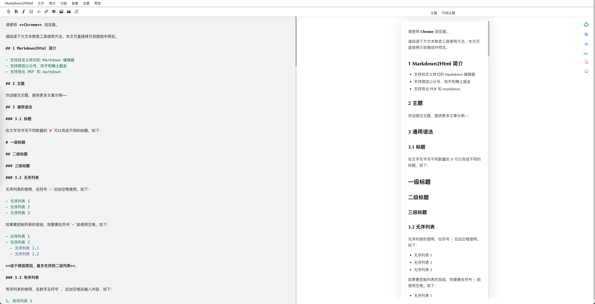

# Markdown2Html

### 在线将 Markdown 转换为 HTML

## 简介

- 支持自定义样式的 Markdown 编辑器
- 支持微信公众号、知乎和稀土掘金
- 支持公式
- 支持 HTML 转 Markdown
- 支持导出 PDF 和 Markdown

## 说明

- 原作地址中的在线站点已不可用，此处删除了代码中的无效链接，并重新部署了一个在线站点。
- 欢迎[在线使用](https://tool.0000929.xyz/markdown2html/)。

## 原地址

- https://github.com/TaleAi/markdown2html
